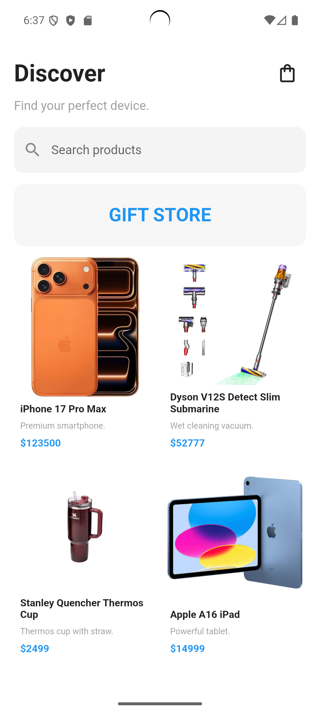
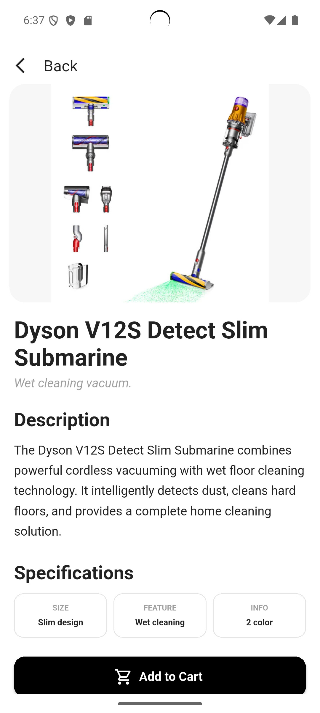
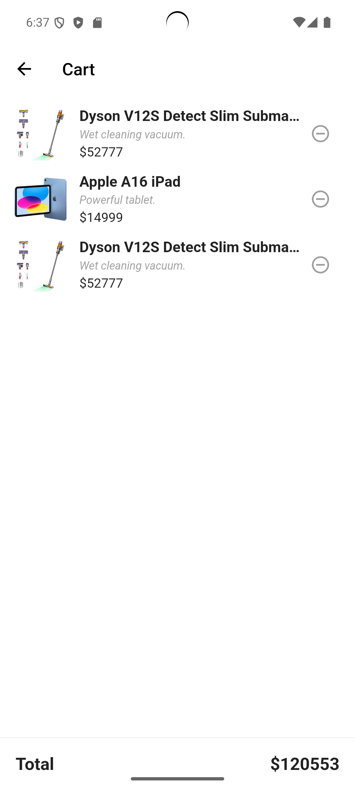
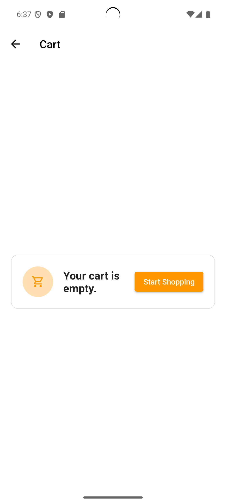

# Mini Catalog Application

Project Overview

Mini Catalog Application is a mobile application developed using Flutter and Dart. The application provides a simple product catalog experience where users can browse products, search for products, view detailed product information, and manage a shopping cart.

## Features

- Product Listing
- Product Detail Page
- Search Products
- Shopping Cart
- Add To Cart
- Remove From Cart
- Navigation Between Pages
- Asset Image Management

## Technologies

- Flutter
- Dart
- Material Design

## Flutter Version

Flutter 3.x

## How To Run

1. Clone the repository
2. Open the project in VS Code or Android Studio
3. Run:

```bash
flutter pub get
flutter run


---

## Home page



## Product Detail


## Cart



## Empty Cart


